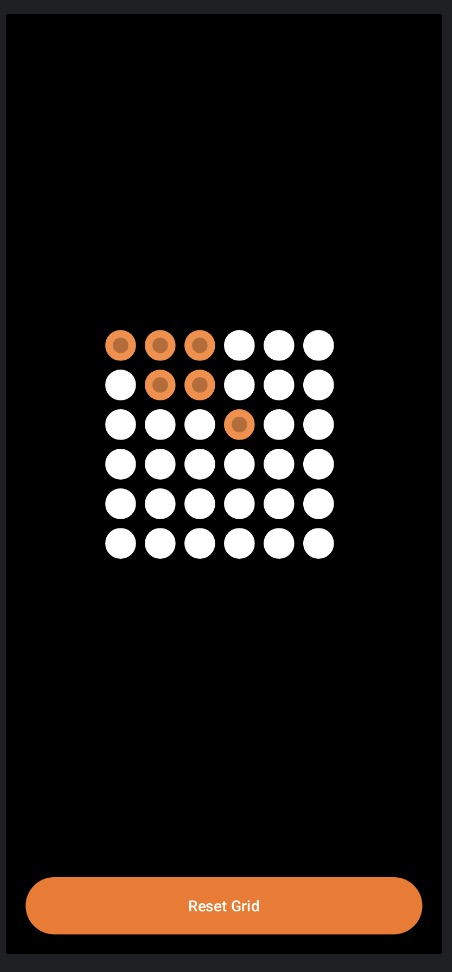
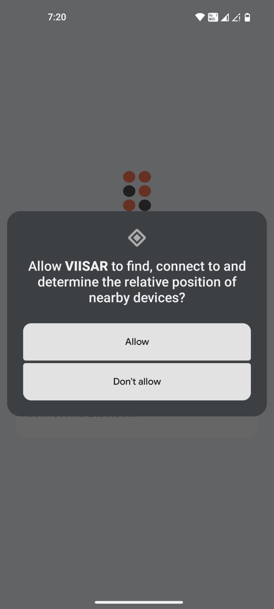
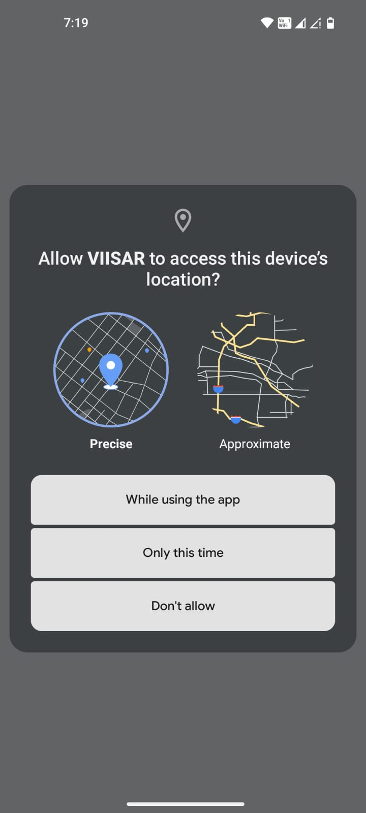
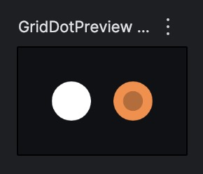
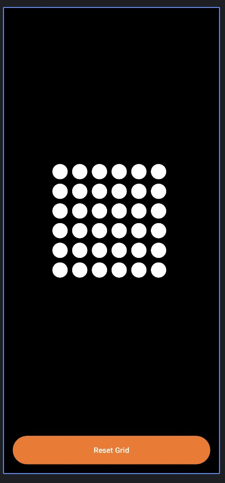

# VIISAR Controller  
Android app + ESP32 WiFi/BLE Grid Controller


---

## Overview
VIISAR Controller is an Android application built to control and visualize a grid-based interface connected to an ESP32 over WiFi or BLE.  
The project focuses on a minimal UI, responsive interaction, adjustable grid layout, and improved runtime stability using Jetpack Compose.

The app includes onboarding permissions, splash screen handling, and theme support while maintaining a clean Compose-based structure.

---

## Features
- Dark and Light theme support
- Interactive grid-based controller
- Adjustable grid size
- Splash screen on launch
- Runtime permission handling (Bluetooth and Location)
- Stability improvements and bug fixes
- Designed for ESP32 integration

---

## Tech Stack
- Language: Kotlin
- UI Framework: Jetpack Compose
- Hardware: ESP32
- Build System: Gradle (KTS)

---

## Screenshots


### Permissions and Onboarding



### UI Components


### Grid Interface



---

## Permissions
The application requests the following permissions:

- Nearby Devices (Bluetooth scanning and connection)
- Location access (required for Android BLE functionality)

These permissions are necessary for discovering and communicating with ESP32 devices.

---

## Getting Started

### Clone the Repository
```bash
git clone https://github.com/Pulkit-10-0/viisar-controller.git
cd viisar-controller
Open in Android Studio

Use the latest stable Android Studio

Allow Gradle sync

Run the App

Connect a physical Android device or start an emulator

Build and run the project
```


## Project Structure

```
.
├── app/
├── VISAR_ESP/
├── photos/
├── gradle/
├── build.gradle.kts
└── settings.gradle.kts
```

## Development Focus

- UI refinement

- Performance and stability

- ESP32 communication improvements

- Enhanced grid interaction logic

- Contributing

- Create a new feature branch before making changes and open a pull request when ready.

## License

This project is intended for educational and experimental purposes.
